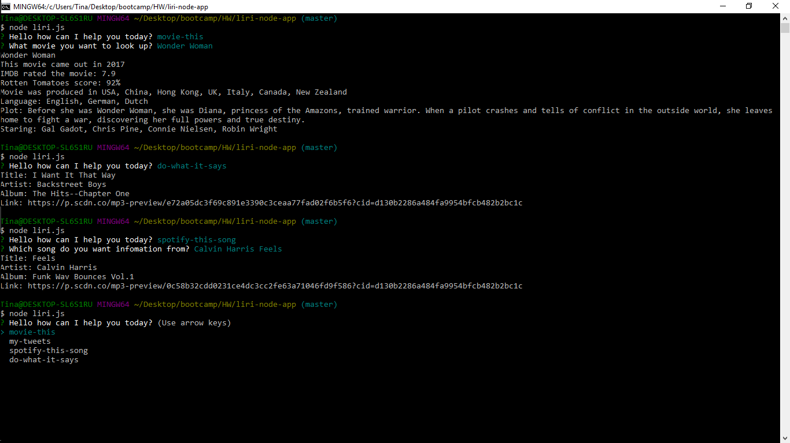

# liri-node-app

LIRI is a Language Interpretation and Recognition Interface. LIRI is a command line node app that takes in parameters and gives you back data.You get to pick what data you want to be given back. 

You will be given a choice between these: 

•	my-tweets: Base on the username you have enter it will give you the latest 20 tweets and the time that it was posted to you from Twitter. If you do not enter anything a default username will be looked up and you will get its 20 tweets and time stamps will be provided.  

•	spotify-this-song: you will get information from the song you want from Spotify. When you enter a song title you will get the artist(s) name, song name, the name of the album the song is from, and a preview link of the song from Spotify. If you enter nothing the default song will be "The Sign" by Ace of Base.

•	movie-this: information about a movie you want will be from OMB API. When you enter, a movie title the first movie result will be the information you will receive. The data you receive will contain the title of the movie, year the movie came out, IMDB rating, Rotten Tomatoes rating, the country the movie was produce, language of the movie, the plot, and actors that where in the movie.

•	do-what-it-says: if you pick this choice LIRI will read the file random.txt and execute whatever command is in there. 

As you ask LIRI your search results will be recored into the log.txt file. 

